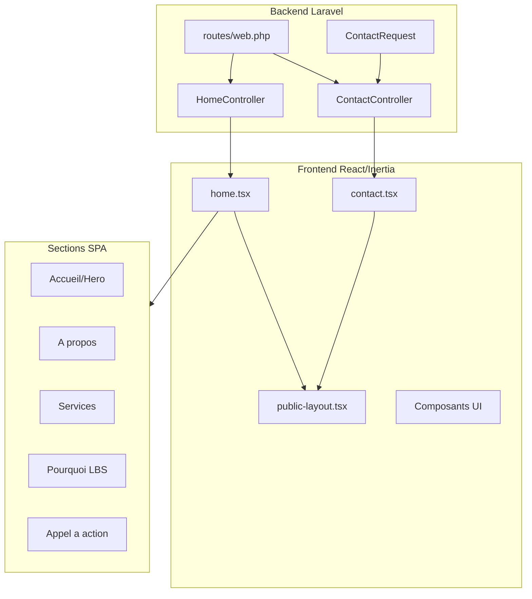

# Plan - Site Web Vitrine SPA LBS

## Contexte

Le projet Laravel 12 + Inertia + React (TSX) existe avec Wayfinder et Tailwind CSS 4. La page welcome actuelle est la page par defaut Laravel. Le site vitrine LBS necessite une refonte complete du frontend public.

## Architecture cible

## Fichiers a modifier/creer

### 1. Backend Laravel

| Fichier | Action ||---------|--------|| [routes/web.php](routes/web.php) | Modifier les routes publiques || `app/Http/Controllers/HomeController.php` | Creer || `app/Http/Controllers/ContactController.php` | Creer || `app/Http/Requests/ContactRequest.php` | Creer |

### 2. Frontend React/TSX

| Fichier | Action ||---------|--------|| [resources/js/pages/welcome.tsx](resources/js/pages/welcome.tsx) | Supprimer ou remplacer par home.tsx || `resources/js/pages/home.tsx` | Creer - Page principale SPA || `resources/js/pages/contact.tsx` | Creer - Page contact || `resources/js/layouts/public-layout.tsx` | Creer - Layout public || `resources/js/components/public/` | Creer - Composants sections |

### 3. Styles et identite visuelle

| Fichier | Action ||---------|--------|| [resources/css/app.css](resources/css/app.css) | Ajouter palette LBS (violet, bleu, blanc) |

## Implementation detaillee

### Phase 1 : Configuration et routes

1. Creer `HomeController` avec methode `index()` retournant la page home
2. Creer `ContactController` avec methodes `index()` et `store()`
3. Creer `ContactRequest` pour validation du formulaire
4. Mettre a jour [routes/web.php](routes/web.php) avec routes nommees :

- `GET /` -> `home` 
- `GET /contact` -> `contact.index`
- `POST /contact` -> `contact.store`

### Phase 2 : Layout et navigation

1. Creer `public-layout.tsx` avec :

- Header fixe avec logo LBS et navigation
- Navigation par ancres (scroll fluide)
- Footer institutionnel

2. Implementer la navigation responsive (mobile menu)

### Phase 3 : Page principale (SPA)

Creer `home.tsx` avec sections :

1. **Hero/Accueil** : Banniere avec logo, message cle, CTA
2. **A propos** : Presentation, mission, vision, valeurs
3. **Services** : 3 services avec icones et descriptions
4. **Pourquoi LBS** : 4 avantages cles
5. **Appel a action** : Section finale avec CTA contact

### Phase 4 : Page Contact

Creer `contact.tsx` avec :

- Formulaire (nom, email, entreprise, message)
- Coordonnees officielles
- Message de confirmation apres soumission
- Validation frontend et backend

### Phase 5 : Identite visuelle

Mettre a jour `app.css` avec la palette LBS :

- **Primaire** : Violet (#6B21A8 ou similaire)
- **Secondaire** : Bleu (#1E40AF ou similaire)  
- **Neutre** : Blanc (#FFFFFF)
- Typographie moderne et lisible

## Contraintes techniques respectees

- Convention kebab-case pour fichiers TSX
- Routes nommees uniquement
- Wayfinder pour toutes les URLs